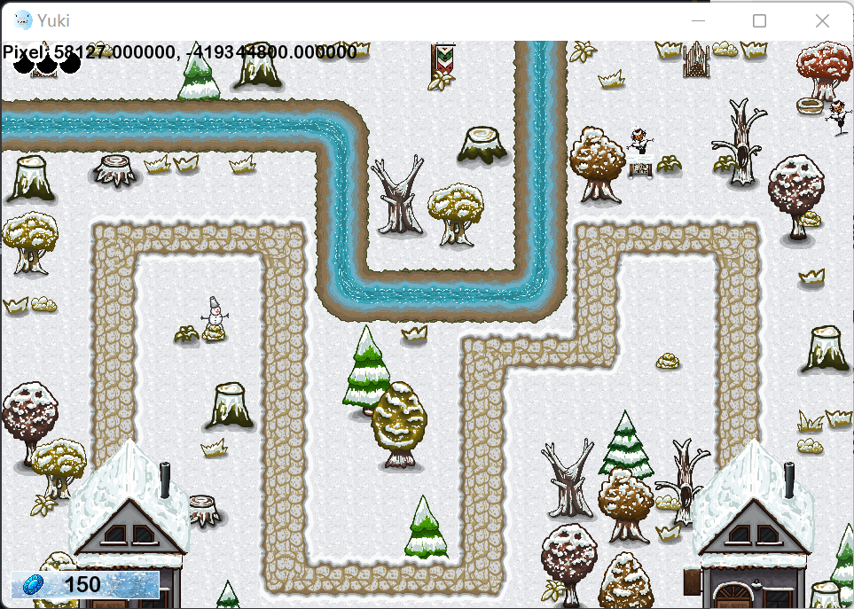

# Yuki

本游戏是2021-2022学年第一学期微电子学院《数据结构与算法（H）》课程的课程设计作业。



## 如何编译？

测试时使用的是C++17标准，你应该使用支持C++17标准的编译器。

在项目根目录下新建文件夹`deps`，在其中放入[SFML库](https://www.sfml-dev.org/download.php)。

预期效果如下：

```
deps
  |- SFML-2.5.1
       |- bin
       |- include
       |- lib
       ...

```

在项目根目录下新建文件夹`build`，在其中执行`cmake ..`，然后执行`cmake --build .`。

## 如何运行？

### Windows 

在二进制文件所在目录下复制`assets`文件夹到`build`文件夹下，并复制`deps/SFML-2.5.1/bin`文件夹下的`.dll`文件到`build`文件夹下。

### macOS

待测试。
